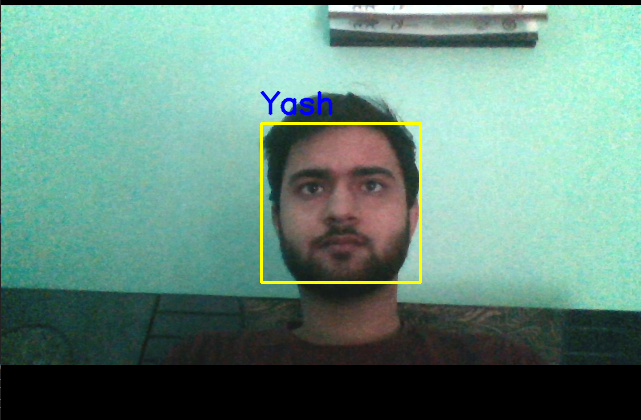

# Real_Time_Face_Recognition
The Machine Learning Model detects the face of the person at real time and displays the name by enclosing the face in a square.
<br/>
# Requirements: <br/>
1. Python <br/> <br/>

# HOW TO GET IT TO WORK: <br/>
1. Clone the repository. <br/>
2. Open terminal. <br/>
3. Navigate to the cloned repository. <br/>
4. Run the command ```python "Crop the image and flatten in nparray.py" ``` <br/>
    <p align="center">
        
    </p>
5. Press 'q' when done capturing the data. <br/>
6. Run command ```python predict.py``` <br/>
    <p align="center">
        
    </p>
7. The Model predicts your name and positions a rectangle around your face.<br/>
<br/>

# Details: <br/>
The model usses haarcascade for face detection. Runnung the first file forms the dataset by capturing the image data of the person and saving it as a numpyarray. Second file predicts the name of the concerned user.
